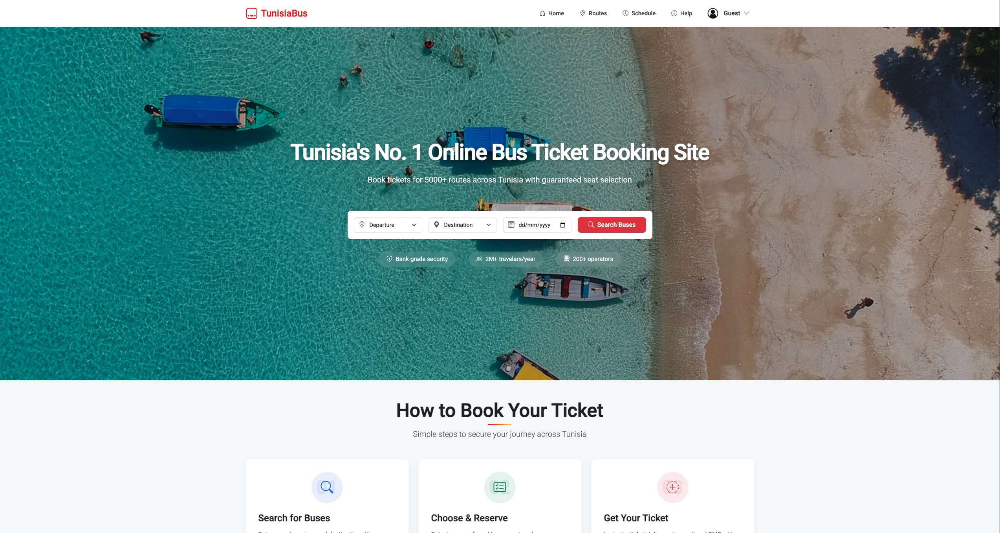

# Bus Ticket Booking Website

A full-stack web application for browsing, booking, and managing bus tickets. Built with Angular on the frontend and Node.js/Express on the backend.

## Home Page




## Features

- Search available bus routes
- View bus details and seat availability
- Book tickets and receive confirmation
- Manage user profile and booking history
- Admin panel for managing drivers, buses, and routes

## Tech Stack

**Frontend:**
- Angular 19
- TypeScript
- Bootstrap

**Backend:**
- Node.js
- Express.js
- MongoDB 


## Installation

### Prerequisites
- Node.js and npm
- Angular CLI
- MongoDB or JSON Server (optional)


### 🔧 Clone the Repository

```bash
git clone https://github.com/Anasazx/bus-ticket-booking.git
cd bus-ticket-booking
```

---

### 🧩 Install Frontend and Backend Dependencies

**Install Frontend:**

```bash
cd frontend
npm install
```

**Install Backend:**

```bash
cd ../backend
npm install
```

---

### ▶️ Run the App

**Start the backend server:**

```bash
cd backend
node server.js
```

**Start the frontend app:**

```bash
cd ../frontend
ng serve
```

Access the app at: [http://localhost:4200](http://localhost:4200)

---

## 📁 Folder Structure

```bash
bus-ticket-booking/
├── frontend/          # Angular App
│   ├── src/
│   └── ...
├── backend/           # Node.js API
│   ├── routes/
│   ├── models/
│   └── ...
└── README.md
```

---

## License

This project is licensed under the [MIT License](LICENSE).